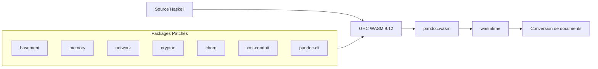

# Pandoc WASM

> Pandoc 3.8.3 compilé en WebAssembly pour la conversion de documents dans des environnements WASI.

[](https://pandoc.org/)
[](https://gitlab.haskell.org/haskell-wasm/ghc-wasm-meta)
[](#disclaimer)

---

## Disclaimer / Avertissement

> **Ce projet est expérimental et constitue avant tout un travail de recherche.**

- Les patches appliqués aux dépendances Haskell peuvent ne pas être parfaits et n'ont pas été audités de manière exhaustive
- Ce projet peut ne pas convenir à tous les cas d'usage, notamment en production
- Les fichiers de travail de **Ralph** (agent IA) ont été volontairement conservés dans le dossier `.ralph/` pour montrer la méthodologie et le processus de développement
- Le binaire résultant (166 MB) est optimisé pour la compatibilité WASI, pas pour la taille

**Utilisez ce projet en connaissance de cause et à vos propres risques.**

---

## Introduction

Ce projet permet de compiler [Pandoc](https://pandoc.org/), le convertisseur de documents universel, en WebAssembly (WASM) pour l'exécuter dans des environnements compatibles WASI (WebAssembly System Interface).

### Résultat

- **Binaire** : `pandoc.wasm` (~166 MB)
- **Runtime** : [wasmtime](https://wasmtime.dev/) ou tout runtime WASI compatible
- **Fonctionnalités** : Conversion Markdown vers HTML, PPTX, DOCX, et autres formats supportés par Pandoc
- **Limitations** : Pas de réseau, pas de Lua, pas de serveur HTTP (voir [Limitations](#limitations))

---

## Comment ça fonctionne



Le compilateur GHC WASM cross-compile le code Haskell vers WebAssembly. Plusieurs packages ont dû être patchés pour supporter la plateforme 32-bit WASM et l'environnement WASI limité.

---

## HOW TO : Compiler soi-même

### Prérequis

| Outil | Version | Description |
|-------|---------|-------------|
| [ghc-wasm-meta](https://gitlab.haskell.org/haskell-wasm/ghc-wasm-meta) | 9.12 | Compilateur GHC pour WASM |
| [wasmtime](https://wasmtime.dev/) | >= 41.0 | Runtime WASI pour exécuter le binaire |
| [cabal](https://www.haskell.org/cabal/) | >= 3.10 | Gestionnaire de packages Haskell (inclus dans ghc-wasm-meta) |

### Étape 1 : Installer ghc-wasm-meta

```bash
# Installation du compilateur GHC WASM
cd ~
curl -sSL https://gitlab.haskell.org/haskell-wasm/ghc-wasm-meta/-/raw/master/bootstrap.sh | FLAVOUR=9.12 sh

# Charger l'environnement (à ajouter dans ~/.zshrc ou ~/.bashrc)
source ~/.ghc-wasm/env

# Vérifier l'installation
wasm32-wasi-ghc --version
# Devrait afficher: The Glorious Glasgow Haskell Compilation System, version 9.12.x
```

### Étape 2 : Cloner ce repository

```bash
git clone https://github.com/votre-repo/pandoc-wasm.git
cd pandoc-wasm
```

### Étape 3 : Mettre à jour l'index des packages

```bash
source ~/.ghc-wasm/env
wasm32-wasi-cabal update
```

### Étape 4 : Compiler Pandoc

```bash
# Compilation (peut prendre 30-60 minutes selon votre machine)
# L'option -j1 évite les race conditions de compilation
wasm32-wasi-cabal build pandoc-cli -j1

# Le binaire se trouve dans :
# dist-newstyle/build/wasm32-wasi/ghc-9.12.x/pandoc-cli-3.8.3/x/pandoc/build/pandoc/pandoc.wasm
```

### Étape 5 : Copier le binaire

```bash
cp dist-newstyle/build/wasm32-wasi/ghc-*/pandoc-cli-3.8.3/x/pandoc/build/pandoc/pandoc.wasm .
ls -lh pandoc.wasm
# Devrait afficher ~166M
```

### Étape 6 : Tester

```bash
# Test simple : Markdown vers HTML
echo "# Hello World" | wasmtime run --dir . pandoc.wasm

# Test : Markdown vers PowerPoint
wasmtime run --dir . pandoc.wasm -o output.pptx tests/small.md
ls -la output.pptx

# Tests de validation complets
wasmtime run --dir . pandoc.wasm -o small.pptx tests/small.md
wasmtime run --dir . pandoc.wasm -o medium.pptx tests/medium.md
wasmtime run --dir . pandoc.wasm -o large.pptx tests/large.md
echo "Tests réussis si les 3 fichiers .pptx sont créés"
```

---

## Utilisation

### Syntaxe de base

```bash
wasmtime run --dir . pandoc.wasm [OPTIONS] [FICHIER_ENTREE]
```

> **Important** : L'option `--dir .` est obligatoire pour donner accès au système de fichiers via WASI.

### Exemples

```bash
# Markdown vers HTML (sortie standard)
wasmtime run --dir . pandoc.wasm document.md

# Markdown vers PowerPoint
wasmtime run --dir . pandoc.wasm -o presentation.pptx document.md

# Markdown vers DOCX
wasmtime run --dir . pandoc.wasm -o document.docx input.md

# Spécifier les formats explicitement
wasmtime run --dir . pandoc.wasm -f markdown -t html document.md

# Depuis stdin
echo "# Titre" | wasmtime run --dir . pandoc.wasm -t html
```

### Formats supportés

Les formats de Pandoc sont supportés, à l'exception de ceux nécessitant :
- Des appels réseau (HTTP)
- Le moteur Lua
- Des processus externes (LaTeX pour PDF)

---

## Collaboration avec Ralph

Ce projet a été réalisé avec l'aide de **Ralph**, un agent IA autonome spécialisé dans les tâches de développement complexes. Ralph a travaillé sur ce projet en **4 sessions**, documentées dans le dossier `.ralph/`.

### Fichiers de travail conservés

| Fichier | Description |
|---------|-------------|
| `.ralph/progress.md` | Journal de progression détaillé |
| `.ralph/signs.md` | Leçons apprises et pièges à éviter |
| `.ralph/activity.log` | Log des commandes exécutées |
| `.ralph/tasks.yaml` | État des tâches |
| `RALPH_TASK.md` | Définition initiale de la tâche |

### Pourquoi conserver ces fichiers ?

Ces fichiers montrent :
1. **La méthodologie** : Comment aborder la compilation WASM de projets Haskell complexes
2. **Les obstacles rencontrés** : Problèmes de compatibilité 32-bit, APIs manquantes, etc.
3. **Les solutions appliquées** : Patches spécifiques pour chaque package
4. **La transparence** : Le processus complet de développement est visible

---

## Packages Patchés

Sept packages ont nécessité des modifications pour compiler en WASM. Voir [SECURITY.md](SECURITY.md) pour les détails techniques et implications de sécurité.

| Package | Version | Raison du patch |
|---------|---------|-----------------|
| `basement` | 0.0.16 | Compatibilité 32-bit, suppression GHC.IntWord64 |
| `memory` | 0.18.0 | Désactivation mmap, corrections FFI |
| `network` | 3.2.8.0 | Stubs pour fonctions socket non supportées par WASI |
| `cborg` | 0.2.10.0 | Corrections primitives 32-bit |
| `crypton` | 1.0.5 | Désactivation pthread (ARGON2_NO_THREADS) |
| `xml-conduit` | 1.10.1.0 | Build-type Custom → Simple |
| `pandoc-cli` | 3.8.3 | Suppression flag -threaded |

---

## Limitations

### Fonctionnalités désactivées

| Fonctionnalité | Raison | Alternative |
|----------------|--------|-------------|
| **Lua scripting** | Complexité d'intégration WASM | Utiliser des filtres JSON |
| **Serveur HTTP** | Pas de réseau en WASI | N/A |
| **Requêtes réseau** | WASI ne supporte pas les sockets | Télécharger les ressources localement |
| **PDF via LaTeX** | Nécessite processus externe | Utiliser HTML ou DOCX |

### Contraintes techniques

- **Mono-thread** : Le runtime WASM n'a pas de threading
- **Pas de mmap** : Memory-mapping désactivé
- **Fonctions réseau stubées** : Retournent `ENOSYS`
- **Taille du binaire** : ~166 MB (données embarquées)

---

## Leçons apprises

Extraits de `.ralph/signs.md` - les pièges à éviter lors de la compilation WASM :

### GHC.IntWord64 supprimé dans GHC 9.4+

> Les primitives `Int64#`/`Word64#` sont maintenant dans `GHC.Prim`, pas `GHC.IntWord64`.

### Packages avec Custom Setup.hs

> Les packages avec `build-type: Custom` échouent car le Setup.hs est compilé pour le HOST, pas la TARGET WASM. Solution : patcher vers `build-type: Simple`.

### Flag -threaded incompatible

> GHC WASM n'a pas de runtime threadé. Retirer `-threaded` des ghc-options.

### Stubs réseau WASI

> WASI P1 fournit certaines fonctions socket (accept, send, recv) mais pas d'autres (socket, bind, listen, connect). Ne stubber que les fonctions manquantes.

---

## Structure du projet

```
pandoc-wasm/
├── README.md              # Ce fichier
├── SECURITY.md            # Détails des patches de sécurité
├── RALPH_TASK.md          # Définition de la tâche pour Ralph
├── cabal.project          # Configuration de build Cabal
├── .gitignore
├── tests/                 # Fichiers de test Markdown
│   ├── small.md
│   ├── medium.md
│   ├── large.md
│   └── test.md
├── patches/               # Packages Haskell patchés
│   ├── basement-0.0.16/
│   ├── memory-0.18.0/
│   ├── network-3.2.8.0/
│   ├── cborg-0.2.10.0/
│   ├── crypton-1.0.5/
│   ├── xml-conduit-1.10.1.0/
│   └── pandoc-cli-3.8.3/
└── .ralph/                # Fichiers de travail Ralph
    ├── progress.md
    ├── signs.md
    ├── activity.log
    └── tasks.yaml
```

---

## Licence

Ce projet utilise Pandoc qui est sous licence GPL-2.0-or-later. Les patches sont fournis sous la même licence que les packages originaux.

---

## Acknowledgment

Ce projet s'inspire du travail de [haskell-wasm/pandoc-wasm](https://github.com/haskell-wasm/pandoc-wasm), qui a démontré la faisabilité de compiler Pandoc en WebAssembly.

---

## Ressources

- [Pandoc Documentation](https://pandoc.org/MANUAL.html)
- [GHC WASM Meta](https://gitlab.haskell.org/haskell-wasm/ghc-wasm-meta)
- [WASI Specification](https://wasi.dev/)
- [Wasmtime](https://wasmtime.dev/)
